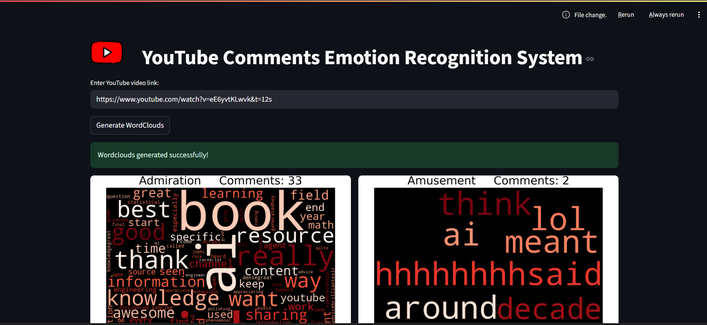
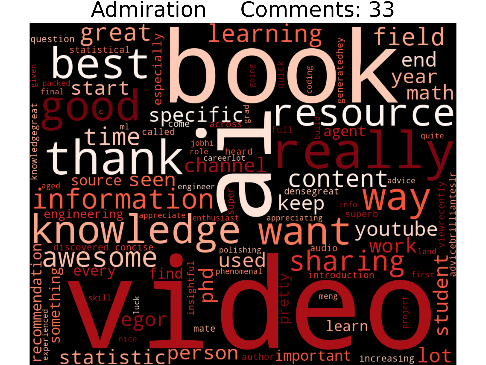
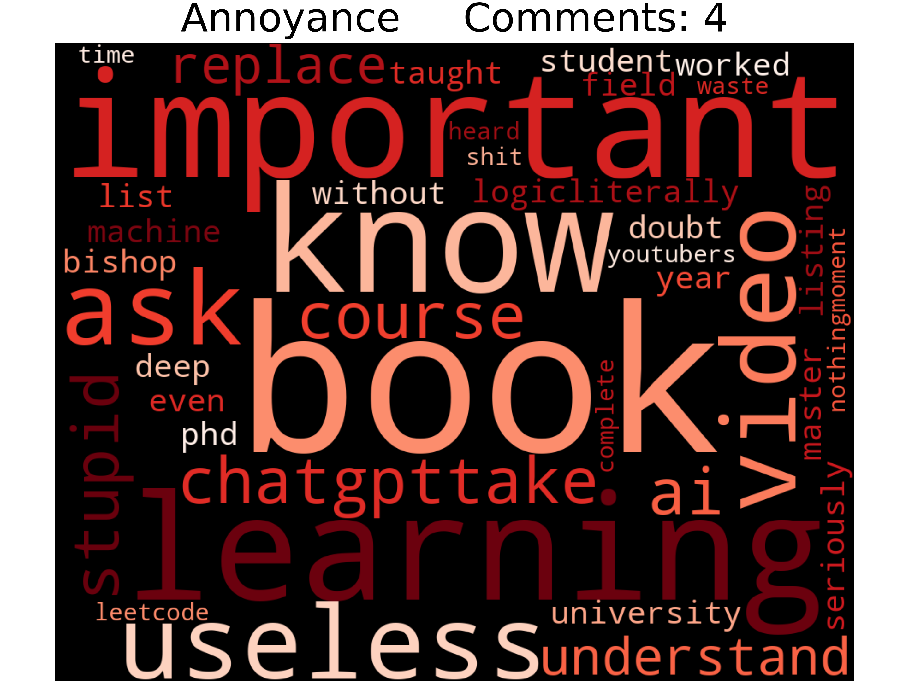
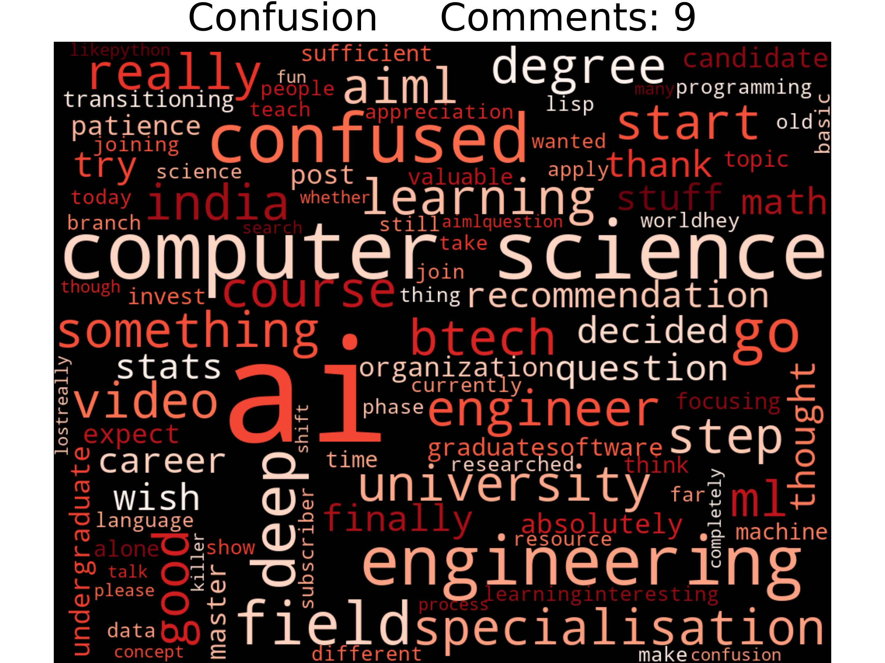
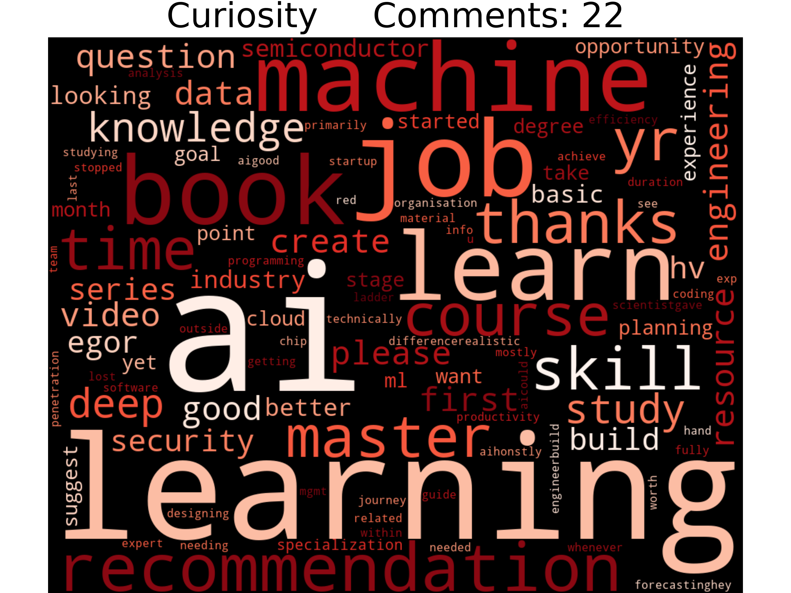

# YouTube Comments Emotion Recognition 🎭  

This project analyzes **YouTube video comments** and detects the **emotions** expressed in them.  
It uses the **YouTube API** to fetch comments and applies the **EmoRoBERTa model** (trained on 58k Reddit comments) to classify them into **28 emotions + neutral**.  
The system then generates **word clouds per emotion**, giving creators insights into how their content resonates emotionally.  

---

## 📸 Screenshots  

> Replace these with your actual images  

- Web Interface Example  
  

- Sample Word Cloud  
  
  
  
  

---

## 🚀 Features  

- Fetches comments from any YouTube video via **YouTube API**  
- Classifies comments into **29 categories**:  
  admiration, amusement, anger, annoyance, approval, caring, confusion, curiosity, desire, disappointment, disapproval, disgust, embarrassment, excitement, fear, gratitude, grief, joy, love, nervousness, optimism, pride, realization, relief, remorse, sadness, surprise, and neutral  
- Generates **word clouds** for each detected emotion  
- Interactive **Streamlit web app** (`main.py`)  
- Helps content creators understand emotional audience feedback  

---

## 📂 Repository Structure  

```
YouTube_Comments_Emotion_Recognition/
├── .gitignore
├── README.md
├── assets
    ├── admiration.png
    ├── annoyance.png
    ├── app_interface.png
    ├── confusion.png
    ├── curiosity.png
    └── youtube_logo.png
├── generate_wordclouds.py
├── main.py
├── notebook
    └── yt_comments_emotion_recognition.ipynb
├── requirements.txt
└── util_funcs
    ├── comments.csv
    ├── get_comments.py
    ├── predict.py
    └── preprocess_comments.py
```

---

## ⚙️ Installation & Setup  

### 1. Clone the repository  
```bash
git clone https://github.com/ahmedfarazsyk/YouTube_Comments_Emotion_Recognition.git
cd YouTube_Comments_Emotion_Recognition
```

### 2. Install dependencies  
```bash
pip install -r requirements.txt
```

### 3. Get a YouTube API key  
- Go to [Google Cloud Console](https://console.cloud.google.com/)  
- Create a project → Enable **YouTube Data API v3**  
- Generate an **API key**  
- Save the key inside a `.env` file as:  
```
API_KEY=your_api_key_here
```

### 4. Clone EmoRoBERTa model  

- Make sure git-lfs is installed (https://git-lfs.com)
```bash
git lfs install
git clone https://huggingface.co/arpanghoshal/EmoRoBERTa
```

- When prompted for a password, use an access token with write permissions.
- Generate one from your settings: https://huggingface.co/settings/tokens


### 5. Run the Streamlit app  
```bash
streamlit run main.py
```

---

## 🔮 Future Improvements  

- Dockerize the project (current image size ~5GB makes Docker Hub push difficult)  
- Deploy on **AWS EC2 / SageMaker** for scalable access  
- Optimize model size for easier cloud deployment  

---

## 👨‍💻 Author  

**Ahmed Faraz Shaikh**  
[GitHub Profile](https://github.com/ahmedfarazsyk)  

